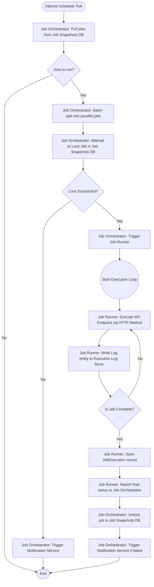

### Activity Diagram for UC2.1

```mermaid
flowchart TD
    %% Start of internal schedule tick
    Start([Internal Schedule Tick]) --> Pull[Job Orchestrator: Pull jobs from Job Snapshots DB]
    
    Pull --> JobsFound{Jobs to run?}
    JobsFound -->|No| End([End])
    
    %% Batching and Execution
    JobsFound -->|Yes| Batch[Job Orchestrator: Batch split into parallel jobs]
    Batch --> Lock[Job Orchestrator: Attempt to Lock Job in Job Snapshots DB]
    
    Lock --> LockCheck{Lock Successful?}
    
    %% Failure to lock scenario
    LockCheck -->|No| NotifyFail[Job Orchestrator: Trigger Notification Service]
    NotifyFail --> End
    
    %% Successful lock scenario
    LockCheck -->|Yes| Trigger[Job Orchestrator: Trigger Job Runner]
    
    Trigger --> ExecLoop((Start Execution Loop))
    ExecLoop --> RunInt[Job Runner: Execute API Endpoint via HTTP Method]
    RunInt --> Stream[Job Runner: Write Log entity to Execution Log Store]
    
    Stream --> DoneCheck{Is Job Complete?}
    DoneCheck -->|No| RunInt
    
    %% Completion and teardown
    DoneCheck -->|Yes| SaveExec[Job Runner: Save JobExecution record]
    SaveExec --> Report[Job Runner: Report final status to Job Orchestrator]
    Report --> Unlock[Job Orchestrator: Unlock job in Job Snapshots DB]
    Unlock --> NotifyFlow[Job Orchestrator: Trigger Notification Service if failed]
    NotifyFlow --> End
```