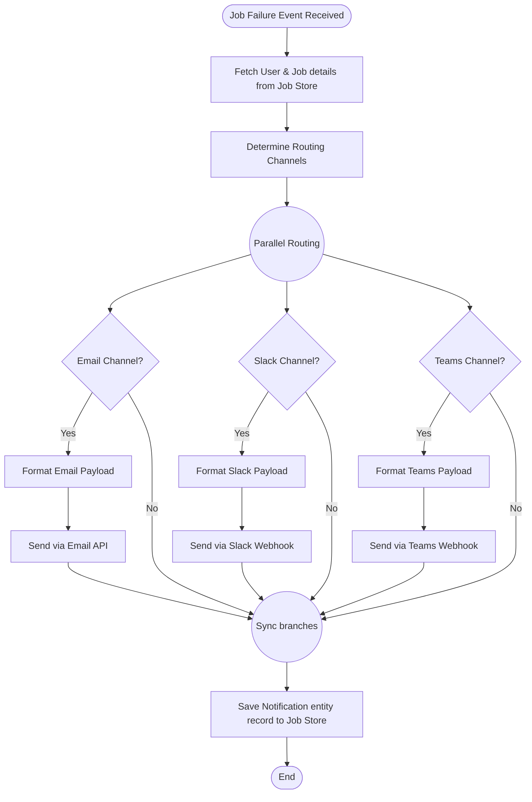

### Activity Diagram for UC3.2

```mermaid
flowchart TD
    %% Start of processing
    Start([Job Failure Event Received]) --> Fetch[Fetch User & Job details from Job Store]
    Fetch --> Parse[Determine Routing Channels]
    
    %% Parallel routing to different channels
    Parse --> Fork((Parallel Routing))
    
    %% Email Branch
    Fork --> CheckEmail{Email Channel?}
    CheckEmail -->|Yes| FormatEmail[Format Email Payload] --> SendEmail[Send via Email API] --> Join((Sync branches))
    CheckEmail -->|No| Join
    
    %% Slack Branch
    Fork --> CheckSlack{Slack Channel?}
    CheckSlack -->|Yes| FormatSlack[Format Slack Payload] --> SendSlack[Send via Slack Webhook] --> Join
    CheckSlack -->|No| Join
    
    %% Teams Branch
    Fork --> CheckTeams{Teams Channel?}
    CheckTeams -->|Yes| FormatTeams[Format Teams Payload] --> SendTeams[Send via Teams Webhook] --> Join
    CheckTeams -->|No| Join
    
    %% Wrap up
    Join --> LogStatus[Save Notification entity record to Job Store]
    LogStatus --> End([End])
```