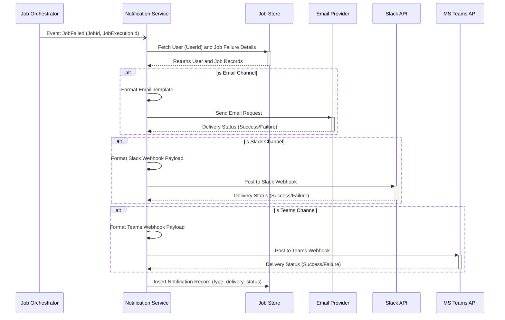

### Sequence Diagram for UC3.2

```mermaid
sequenceDiagram
    participant Orchestrator as Job Orchestrator
    participant Service as Notification Service
    participant DB as Job Store
    participant Email as Email Provider
    participant Slack as Slack API
    participant Teams as MS Teams API

    %% Failure event triggers the process
    Orchestrator-)Service: Event: JobFailed (JobId, JobExecutionId)
    
    %% Fetch User and Job failure details from the primary Job Store
    Service->>+DB: Fetch User (UserId) and Job Failure Details
    DB-->>-Service: Returns User and Job Records

    %% Channel Dispatching
    alt is Email Channel
        Service->>Service: Format Email Template
        Service->>+Email: Send Email Request
        Email-->>-Service: Delivery Status (Success/Failure)
    end
    
    alt is Slack Channel
        Service->>Service: Format Slack Webhook Payload
        Service->>+Slack: Post to Slack Webhook
        Slack-->>-Service: Delivery Status (Success/Failure)
    end

    alt is Teams Channel
        Service->>Service: Format Teams Webhook Payload
        Service->>+Teams: Post to Teams Webhook
        Teams-->>-Service: Delivery Status (Success/Failure)
    end

    %% Finalize by saving the Notification entity
    Service->>DB: Insert Notification Record (type, delivery_status)
```