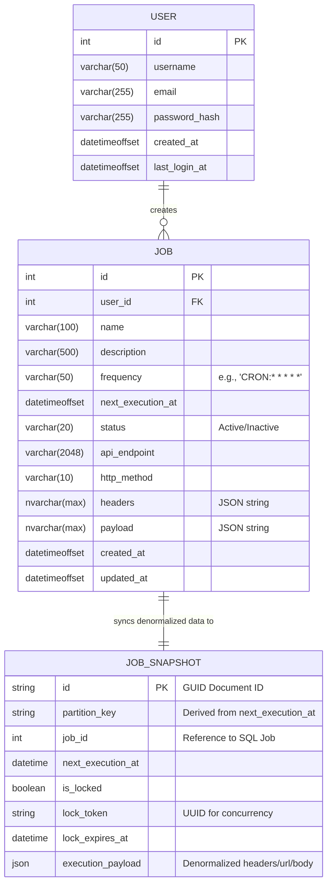

### UC 1.1 Create a new Job

```mermaid
erDiagram
    %% Relational Models (Azure SQL)
    USER ||--o{ JOB : "creates"
    
    %% Sync Relationship to NoSQL
    JOB ||--|| JOB_SNAPSHOT : "syncs denormalized data to"

    USER {
        int id PK
        varchar(50) username
        varchar(255) email
        varchar(255) password_hash
        datetimeoffset created_at
        datetimeoffset last_login_at
    }

    JOB {
        int id PK
        int user_id FK
        varchar(100) name
        varchar(500) description
        varchar(50) frequency "e.g., 'CRON:* * * * *'"
        datetimeoffset next_execution_at
        varchar(20) status "Active/Inactive"
        varchar(2048) api_endpoint
        varchar(10) http_method
        nvarchar(max) headers "JSON string"
        nvarchar(max) payload "JSON string"
        datetimeoffset created_at
        datetimeoffset updated_at
    }

    %% Document Model (Azure Cosmos DB)
    JOB_SNAPSHOT {
        string id PK "GUID Document ID"
        string partition_key "Derived from next_execution_at"
        int job_id "Reference to SQL Job"
        datetime next_execution_at
        boolean is_locked
        string lock_token "UUID for concurrency"
        datetime lock_expires_at
        json execution_payload "Denormalized headers/url/body"
    }
```