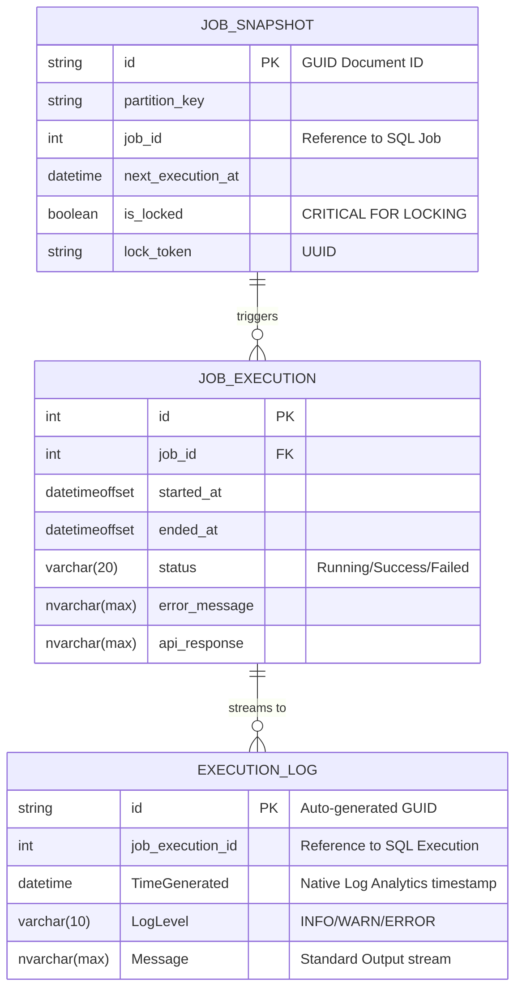

UC 2.1 Execute a Job At a Scheduled Time

```mermaid
erDiagram
    %% Interactions during execution
    JOB_SNAPSHOT ||--o{ JOB_EXECUTION : "triggers"
    JOB_EXECUTION ||--o{ EXECUTION_LOG : "streams to"

    %% Document Model (Azure Cosmos DB - For Orchestrator)
    JOB_SNAPSHOT {
        string id PK "GUID Document ID"
        string partition_key 
        int job_id "Reference to SQL Job"
        datetime next_execution_at
        boolean is_locked "CRITICAL FOR LOCKING"
        string lock_token "UUID"
    }

    %% Relational Model (Azure SQL - For History/State)
    JOB_EXECUTION {
        int id PK
        int job_id FK
        datetimeoffset started_at
        datetimeoffset ended_at
        varchar(20) status "Running/Success/Failed"
        nvarchar(max) error_message
        nvarchar(max) api_response
    }

    %% Time-Series Model (Azure Log Analytics - For Telemetry)
    EXECUTION_LOG {
        string id PK "Auto-generated GUID"
        int job_execution_id "Reference to SQL Execution"
        datetime TimeGenerated "Native Log Analytics timestamp"
        varchar(10) LogLevel "INFO/WARN/ERROR"
        nvarchar(max) Message "Standard Output stream"
    }
```